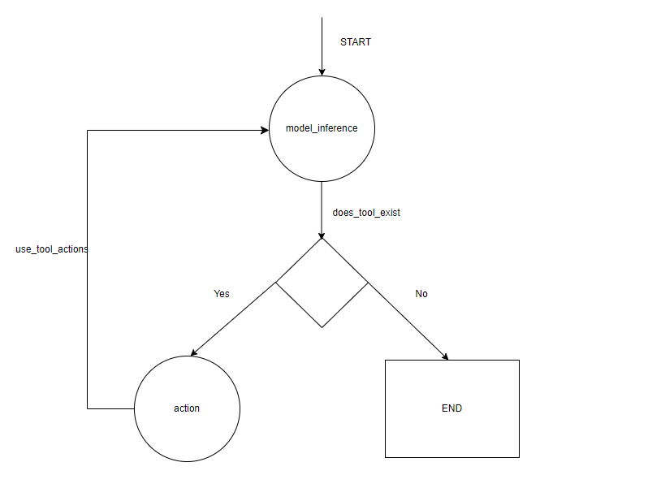

## Sample YF LangGraph Agent

Basic implementation of LangGraph using custom tools to create AI powered YF Agent.

### Run Locally
1. Clone repository
2. Create virtual environment
3. Install requirements (pip install -r requirements.txt)
4. Obtain GROQ API KEY [GROQ Cloud](https://console.groq.com/login) and set as environment variable'
5. Run main.py

## Graph Diagram

